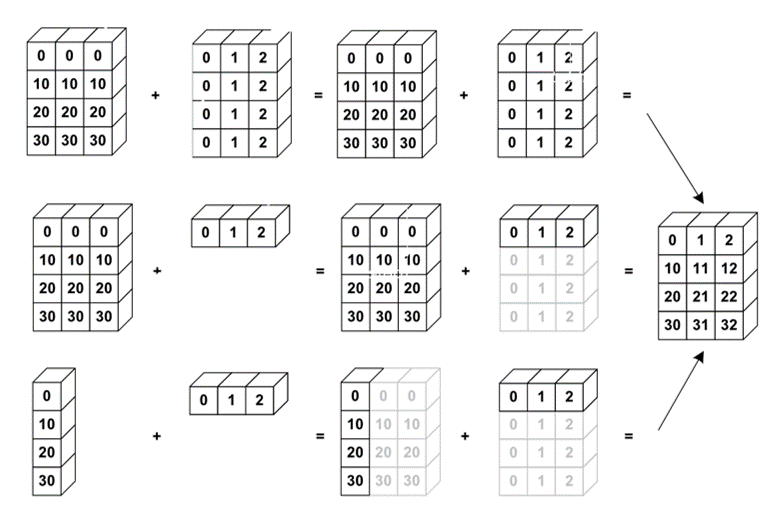
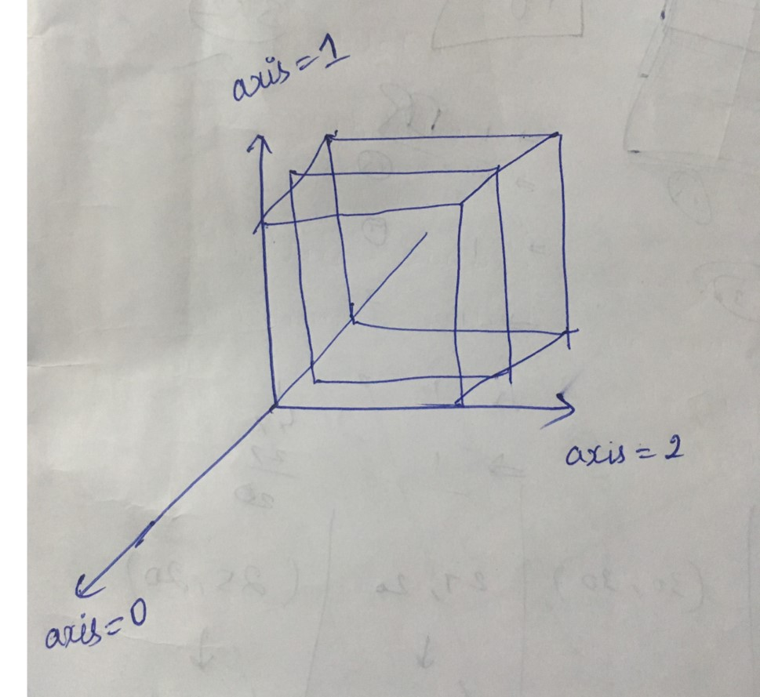

# Basics-in-Numpy:
----------------------------------------------------------------------------------------------------------------------------------
What is Numpy?:
----------------

    NumPy – Numerical Python.
    It is a library consisting of multi-dimensional array objects and a vast number of functions for 
    processing those multi-dimensional arrays.
    It is a Open Source!.
    It performs
      - Mathematical and logical operations on arrays
      - Operations related to linear algebra.
      - Random number generations (1D and nD array ) 

Defining an array: (ndarray):
-----------------------------
    Syntax: 
        arr=numpy.array(object, dtype=None, ndmin=0)

    e.g:
        a=np.array([[[5,3],[4,2],[3,1]],[[5,3],[4,2],[3,1]],[[5,3],[4,2],[3,1]]])  #3D array 
        print(a)
        print(a.shape)			# (3, 3, 2)  ---> (dimension,row,column)

Datatypes in numpy:
-------------------
    Syntax:
        dt=np.dtype(<type>)
        
    Types:
        bool_     - Boolean (True or False)
        int_      - Default integer type (either int64 or int32)  
        int8      - Byte (-128 to 127)
        int16     - Integer (-32768 to 32767)
        int32     - Integer (-2147483648 to 2147483647)
        int64     - Integer (-9223372036854775808 to 9223372036854775807)
        uint8     - Unsigned integer (0 to 255)
        uint16    - Unsigned integer (0 to 65535)
        uint32    - Unsigned integer (0 to 4294967295)
        uint64    - Unsigned integer (0 to 18446744073709551615)
        float_    - Shorthand for float64
        float16   - Half precision float: sign bit, 5 bits exponent, 10 bits mantissa
        float32   - Single precision float: sign bit, 8 bits exponent, 23 bits mantissa
        float64   - Double precision float: sign bit, 11 bits exponent, 52 bits mantissa 
        complex_  - Shorthand for complex128
        complex64 - Complex number, represented by two 32-bit floats (real and imaginary components)
        complex128 - Complex number, represented by two 64-bit floats (real and imaginary components)
        
<arr>.ndim:
-----------------------------------
    
    This function will return the dimension of the numpy array.

    e.g:
        a=np.arange(1200)			# will create random 1200  1D elements
        b=a.reshape(3,20,20)		# depth=3, height=20, width=20
        print(b.shape)				# (3,20,20)
        print(b.ndim)				# 3

Reshaping an array:
-----------------------------------

    Reshaping an array can be done in two ways.
            i) <arr>.shape=(dim,row,column)
            ii) <arr>.reshape(dim,row,column)
            iii) ndmin parameter for dimensions

Reshaping an array using <arr>.shape
-----------------------------------
    
    This function will reshape the original array.
    
    Syntax:
        <arr>.shape=(dimension, row, column)
        
    e.g:
         a=np.array([1,2,3,4,5,6,7,8,9])
         a.shape=(3,3)
         print(a)		# 3x3 2D array  
         print (a.shape) # (3,3)

        a=np.array([1,2,3,4,5,6,7,8,9])
        a.shape=(1,3,3)
        print(a)		# 1x3x3 3D array
        print (a.shape) #(1,3,3)

        a=np.array([1,2,3,4,5,6,7,8,9])
        a.shape=(1,4,4)	# error since no of element is less for the given dimension
        print(a)		 
        print (a.shape) 

Reshaping an array using <arr>.reshape()
------------------------------------------

    This function will return the reshaped array as new array.
    
    Syntax:
        <arr>.reshape(dimension, row, column)
        
    e.g:
        a=np.array([1,2,3,4,5,6,7,8,9])
        b=a.reshape(3,3)
        print(b)		# 3x3 2D array  
        print (b.shape) # (3,3)

        c=a.reshape(1,3,3)
        print(c)		# 1x3x3 3D array
        print (c.shape) #(1,3,3)

        d=a.reshape(1,4,4)	# error since no of element is less for the given dimension
        print(d)		 
        print (d.shape) 
        
Some numpy functions:
----------------------

    NumPy has some useful function to generate the n dimensional arrays. They are,
        - numpy.zeros()
        - numpy.ones()
        - numpy.full()
        - numpy.eye()
        - numpy.random.random()

zeros():
-------

    For the given  dimension, this function will  generate the given dimensional array which filled with zeros.
    
    Syntax:
        numpy.zeros((dimension, row, column))
        
    e.g:
        a=np.zeros((2,2)) 		 #2D array
        print(a)
        print(a.shape)		# (2,2)  array of having all zero elements

        a=np.zeros((3,4,4))  	#3D array
        print(a)
        print(a.shape)		# (3,4,4) array of having all zero elements

        a=np.zeros((10,3,4))  	#10D array
        print(a)
        print(a.shape)		# (10,3,4) array of having all zero elements
        
ones():
--------

    For the given  dimension, this function will  generate the given dimensional array which filled with ones.
    
    Syntax:
        numpy.ones((dimension, row, column))
        
    e.g:
        a=np.ones((2,2))  	#2D array
        print(a)
        print(a.shape)		# (2,2)  array of having all zero elements

        a=np.ones((3,4,4))  	#3D array
        print(a)
        print(a.shape)		# (3,4,4) array of having all zero elements

        a=np.ones((10,3,4))  	#10D array
        print(a)
        print(a.shape)		# (10,3,4) array of having all zero elements

full():
---------
    For the given  dimension, this function will  generate the given dimensional array which filled with single value passed a argument.
    
    Syntax:
        numpy.full((dimension, row, column),value)
        
    e.g:
        a=np.full((2,2),5)  	#2D array
        print(a)
        print(a.shape)		# (2,2)  array of having all elements value as 5

        a=np.full((3,4,4),5)  	#3D array
        print(a)
        print(a.shape)		# (3,4,4) array of having all elements value as 5

        a=np.full((10,3,4),5)  	#10D array
        print(a)
        print(a.shape)		# (10,3,4) array of having all elements value as 5

eye()
------

    For the given  dimension, this function will  generate the given dimensional identity array.
    
    Syntax:
           numpy.eye(row, column)       or        numpy.eye(identity matrix size)
           
    e.g:
        a=np.eye(2)  	# 2D array
        print(a)
        print(a.shape)	# (2,2)  identity matrix 

        a=np.eye(4,4)  	# 2D array since 4x4 can create identity matrix, it will create identity matrix
        print(a)
        print(a.shape)	# (3,4) identity matrix

        a=np.eye(3,4)  	# 2D array since 3x4 can't create identity matrix, it will append zero in 4th 			column 
        print(a)		# (3,3) will be identy matrix and 4th row is zeros
        print(a.shape)	# (3,4) array 

random.random():
----------------

    For the given  dimension, this function will  generate the given dimensional array with random values.
    
    Syntax:
           numpy.random.random(dimension, row, column)
           
    e.g:
        a=np.random.random(2)  	    # 2D array
        print(a)
        print(a.shape)		     # (2,2)  identity matrix 

        a=np.random.random((4,4))    # 2D array since 4x4 can create identity matrix, it will create identity matrix
        print(a)
        print(a.shape)		    # (3,4) identity matrix

    	import cv2
        a=(np.random.random((600,600))*100)  	# (2channel image)
        print(a)
        print(a.shape)				# (600, 600)  ---> (row,column)
        cv2.imshow("img",a)  						
        cv2.waitKey(0)

        a=(np.random.random((88,256,3))*100)       	# the formating is changed in order for cv2 (3 channel image)
        print(a)
        print(a.shape)				# (88,256,3) array
        cv2.imshow("img",a)  						
        cv2.waitKey(0)

Numpy text formatting options
-------------------------------

       np.set_printoptions(<precision>,<linewidth>,<suppress>,<formatter>)    # Set printing options.
       np.get_printoptions()					 # get current printing options.

        Ex:
        np.set_printoptions(precision=4, suppress=True)

         Note: Suppress, if set True, will eliminate scientific notation.
                          if set False, will include scientific notation (Default). 

Array creation from existing data types:
----------------------------------------

    The NumPy arrays are made from the excisting datas such as datatypes such as list, list of tuples, tuples, tuple of tuples or tuple of lists, iterables, strings.
    The functions available for this are,
       - asarray()
       - frombuffer()
       - fromiter()

asarray():
----------

    This function will create numpy array from the excisting datatypes such as list, list of tuples, tuples, tuple of tuples or tuple of lists.
    
    Syntax:
        numpy.asarray(input data, dtype=None, order=None)
        
    e.g:
        a=[1,2,3,4,5,6,7,8]
        print(type(a))     		 # <class 'list’>

        b=np.asarray(a)
        Print (b)			# [1,2,3,4,5,6,7,8]
        print(type(b))			# <class 'numpy.ndarray’>

        c=np.asarray(a,dtype=complex)
        print(c)			# [1.+0.j 2.+0.j 3.+0.j 4.+0.j 5.+0.j 6.+0.j 7.+0.j 8.+0.j]
        print(type(c))			# <class 'numpy.ndarray'>

frombuffer():
--------------

    This function will create numpy array from the the buffer. It interprets buffer as one-dimensional array.
    
    Syntax:
        numpy.frombuffer(buffer, dtype=None,count=-1,offset=0)

    Where
        Buffer  - any object that has buffer
        dtype  - data type
        Count  - number of items to read, -1 means all.
        Offset  - starting position to read.
    e.g:
        a='python programming’		# not working
        b=np.frombuffer(a,dtype='S1')
        print(b)
        print(type(b))

fromiter()
----------
    This function will create numpy array from the iterables. 
    
    Syntax:
    numpy.frombuffer(iterable, dtype=None, count=-1)

    e.g:
        i=range(10)
        a=np.fromiter(i,dtype=float)
        print(a)			# [0. 1. 2. 3. 4. 5. 6. 7. 8. 9.]
        print(type(a))			# <class 'numpy.ndarray'>

Array creation from the range:
-------------------------------

    Numpy provide certain functions for creating numpy array from the given range. 

    These functions are,
        numpy.arange()
        numpy.linspace()
        numpy.logspace()

arange():
-----------
    This function will create numpy array from the given range having start, stop and step values. 
    This array will be having evenly space values.
    
    Syntax:
        numpy.arange(start, stop, step, dtype=None)

    e.g:
        a=np.arange(1,20,2)	# 1D array
        print(a)			# [ 1  3  5  7  9 11 13 15 17 19]
        print(a.shape)		# (10,) 

linspace()
----------
    This function will create numpy array from the given range having start, stop and num values. 
    In this function, instead of step size, the number of evenly spaced values between the interval is specified.
    Syntax:
        numpy.linspace(start,stop,num=50,endpoint,retstep, dtype=None)

    e.g:
        a = np.linspace(1,2)    # within 1 to 2, it should generate default number of values 	(num=50).
        print (a)				# [1. , 1.02040816, . . . , 1.97959184, 2.]
        print (len(a))			#  50 

        a = np.linspace(1,2,5)  # within 1 to 2, it should generate 5 evenly spaced values.
        print (a)				# [1.   1.25 1.5  1.75 2.  ]
        print (len(a))			#  5
        
logspace():
-----------
    This function will create numpy array from the given range having start, stop and num values. 
    
    In this function, num means numbers that are evenly spaced on a log scale.
    
    Syntax:
        numpy.logspace(start,stop,num=50,endpoint,base=10, dtype=None)

    where
        Base  - base scale of log system (default=10)
    e.g:
        a = np.logspace(1,2)    # within 1 to 2, it should generate evenly spaced log values, default number of values (num=50).
        print (a)	          # [ 10., 10.48113134, . . . ,  95.40954763, 100.]
        print (len(a))	          #  50 

        a = np.logspace(1,2,5)   # within 1 to 2, it should generate evenly spaced log values, number of values here num=5.
        print (a)                 	# [ 10.          17.7827941   31.6227766   56.23413252 100.        ]
        print (len(a))		#  5

Arrary: Indexing and Slicing :
------------------------------
    Indexing and Slicing an array in NumPy is similar to indexing and slicing the python array.
    
    In python we have two type of indexing,
        - Positive indexing starts from left to right with 0,1,2,3,... 
        - Negative indexing starts from right to left with -1,-2,-3,... 

    Syntax for python slicing:
             <list_name>[start_index:end_index:step_size]

    For Numpy, slicing we need to add/edit the slicing based on the dimension of the array.

    There are various types of slicing available in numpy. They are,
        - Typical slicing,
        - use of ellipses,
        - Integer Indexing,
        - multidimensional slicing

   I. Typical Slicing:
   
        a=np.arange(0,101,10)	# 1D array
        print (a)				# [ 0 10 20 30 40 50 60 70 80 90 100]
        out=a[5:]				
        print(out)				# [50 60 70 80 90 100]
   II.Ellipses (…):
   
        - It works fine for 1D arrays.
        a=np.array([np.arange(0,50,10),np.arange(50,100,10)])   #1D array
        print (a)		#[[ 0 10 20 30 40]
                        #[50 60 70 80 90]]
        print(a.shape)	# (2,5)
        b=a[...,1:3]	# column number 1 and 2 alone 
        print(b)		#[[10 20][60 70]]
        print(b.shape)	#(2,2)
        b=a[1,...]	    # second row alone
        print(b)		#[50 60 70 80 90]
        print(b.shape)	#(5,)
   III. Integer Indexing  
   
        a=np.array([np.arange(0,50,10),np.arange(50,100,10)])   #2D array
        print (a)			# [[ 0 10 20 30 40]
                            # [50 60 70 80 90]]
        print (a.shape)		#   (2, 5)

        b=a[[0,1],[0,4]]	#  zeroth row and zero element,first row fourth element 
                            # (number of elemen in each row and column should be same)	
        print(b)				# [ 0 90] 
        
        c=a[[0,1,0],[0,4,2]]
        print(c)				# [ 0 90 20]
        
   IV. multidimension array slicing
   
        a=np.array([[np.arange(0,50,10),np.arange(50,100,10)],[np.arange(50,75,5),np.arange(0,25,5)]]) #2D array
        print (a)			# [[[ 0 10 20 30 40]
                            #  [50 60 70 80 90]]
                            #  [[50 55 60 65 70]
                            #   [ 0 10 20 30 40]]]		
        print (a.shape)		#  (2, 2, 5)

        #slicing the first row of each dimension
        b=a[:,:1,:]			
        print(b)			# [[[ 0 10 20 30 40]]
                            # [[50 55 60 65 70]]]
        print(b.shape)		# (2,1,5)

        #slicing the first element in the second row of each dimension
        c=a[:,0,:2]
        print (c)			# [[ 0 10]
                            # [50 55]]
        print (c.shape)		# (2, 1)

Broadcasting:
-------------
    In normal way, it is not possible to perform element to element wise operations between the two array of different size.
    Broadcasting is the process of the performing element to element wise operations between the two array of different size.
    It includes arithmetic operations such as, 
        -   Addition
        -   Subtraction
        -  Multiplication
        -  Division
    Broadcasting is possible if the two arrays have any of the below criteria’s,
        -  Two arrays having same dimensions. (arr1=mxm, arr2=mxm)
        -  one array having any dimension while other having 1x1 individual element. (arr1=mxm, arr2=1x1)
        -  Row of one array must match with another array.(arr1=mxm/mxn, arr2=mx1)
        -  Column of one array must match with another array.(arr1=mxn/pxn, arr2=1xn)
    *where m,n,p are different numbers.
    Note: Incase of Dimensions, it must be same for both arrays.

Broadcasting Representation:
----------------------------

Broadcasting Examples using Addition:
-------------------------------------

    1x1 addition:
    ------------
        a=np.ones((5,5))				# equal 2D dimesnion
        a=np.ones((4,5))				# different 2D dimension
        print(a)
        b=3 							# we can directly assing single element
        b=np.array([3])					# else make 1x1 numpy array
        out=a+b   						
        print(out)

        a=np.ones((3,5,5))				# equal 3D dimesnion
        a=np.ones((3,4,5))				# different 3D dimension
        print(a)
        b=3 							# we can directly assing single element
        b=np.array([3])					# else make 1x1 numpy array
        out=a+b   						
        print(out)

    Arr1=mxn/mxm and Arr2=mx1
    """Arr1=mxn/mxm and Arr2=mx1 in 2D array"""
    --------------------------------------------
        #a=np.ones((5,5))				# equal 2D dimension
        a=np.ones((5,3))				# different 2D dimension
        b=np.ones((5,1))				# different 2D dimension
        out=a+b   							
        print(out)
        print(out.shape)				# 

    """Arr1=mxn/mxm and Arr2=mx1 in 3D array"""
    --------------------------------------------
        #a=np.ones((3,5,5))				# equal 3D dimension
        a=np.ones((3,5,3))				# different 3D dimension
        b=np.ones((3,5,1))				# must be in 3D array
        out=a+b   							
        print(out)
        print(out.shape)				# 

    Arr1=mxn/pxn and Arr2=1xn
    """Arr1=mxn/mxm and Arr2=mx1 in 2D array"""
    --------------------------------------------
        #a=np.ones((5,5))				# equal 2D dimension
        a=np.ones((5,3))				# different 2D dimension
        b=np.ones((5,1))				# different 2D dimension
        out=a+b   							
        print(out)
        print(out.shape)				# 

    """Arr1=mxn/mxm and Arr2=mx1 in 3D array"""
    -------------------------------------------
        #a=np.ones((3,5,5))				# equal 3D dimension
        a=np.ones((3,5,3))				# different 3D dimension
        b=np.ones((3,5,1))				# must be in 3D array
        out=a+b   							
        print(out)
        print(out.shape)				# 

Numpy Indexing functions:
-------------------------

        np.nonzero(<array>)   		#Return the indices of the elements that are non-zero
        np.where(condition,<True op>,<False op>)   # perform operation based on condition and return it as array
        np. take(<array>,<indices>/<axis>)  # Take values from the input array by matching 1d index and data slice
        np.place(<array>,<condition>,<values>) # Change elements of an array based on conditional and input values
        np.put(<array>,<index>,<values>)   # Replaces specified elements of an array with given values based on index
        np.nditer(<array>)  		 # Efficient Ndarray elementwise iterator
        np.ndenumerate(<array>)  	 # Efficient Ndarray index, element iterator
        np.ndindex(<shape>)        	 # Efficient Ndarray index iterator, given the shape of array
       
Iteration Function:
-------------------
    This function will iterate each element through each row by row and dimension by dimension. 

    It is memory/address dependent.

    Syntax:
        np.nditer(arr1, order, flags)

    -  Order will work irrespective of whether the array is modified or not. It will take the modified array. Order can be C type or F type. 
    order=‘C’           iterate via each element in row by row manner not via each row in available 		              dimension (default one).
    order=‘F’           iterate via each element in column by column manner through each dimension
             - Flags will instruct the iterator loop as per the flag.

Numpy Iterator example:
-----------------------

    arr1=np.array([1,4,7,2,5,8,3,6,9])

    for i in np.nditer(arr1):
        print(i)		

    for index,value in np.ndenumerate(arr1):
        print(index,value)

    for index in np.ndindex(3,2,1):
        print(index)

    "Iterations over 2D array"
    --------------------------
        a=np.arange(4)
        b=a.reshape(2,2)
        print(b)
        for i in np.nditer(b,order='C'):
            print(i,"\n")

    "Iterations over 3D array having same height and width"
    -------------------------------------------------------
        a=np.arange(12)
        b=a.reshape(3,2,2)
        print(b)
        for i in np.nditer(b,order=‘F’):
            print(i,"\n")

    "Iterations over 3D array having different height and width"
    ------------------------------------------------------------
        a=np.arange(18)
        b=a.reshape(3,2,3)
        print(b)
        for i in np.nditer(b,order='C'):
            print(i,"\n")

Numpy Logic functions:
---------------------- 
    np.isnan(<element/array>)  # check for nan
    np.isreal(<element/array>)  # check for real number
    np.array_equal(<array1>, <array2>) # True if two arrays have the same shape and elements, False otherwise
    np.array_equiv(<array1>, <array2>) #Returns True if input arrays are shape consistent and all elements equal
    np.greater (<array1>, <array2>)  # Return the truth value of (x1 > x2) element-wise
    np.greater_equal (<array1>, <array2>)  # Return the truth value of (x1 >= x2) element-wise
    np.less (<array1>, <array2>)  # Return the truth value of (x1 < x2) element-wise
    np.less_equal (<array1>, <array2>)  # Return the truth value of (x1 <= x2) element-wise
    np.equal (<array1>, <array2>)  # Return (x1 == x2) element-wise
    np.not_equal (<array1>, <array2>)  # Return (x1 != x2) element-wise

    Note: All of these function return True/False.

    "Iterations over 2D array"
    --------------------------
        a=np.arange(25)
        b=a.reshape(5,5)
        print(b)
        for i in np.nditer(b,order=‘C’):
            print(i,"\n")

    "Iterations over 3D array having same height and width"
    --------------------------------------------------------
        a=np.arange(75)
        b=a.reshape(3,5,5)
        print(b)
        for i in np.nditer(b,order=‘F’):
            print(i,"\n")

    "Iterations over 3D array having different height and width"
    ------------------------------------------------------------
        a=np.arange(30)
        b=a.reshape(3,5,2)
        print(b)
        for i in np.nditer(b,order=‘C’):
            print(i,"\n")

Iteration Function: Memory dependent:
-------------------------------------
    The iterator function works based on how initially the array is assigned. 
    Though we perform modification in array, it iterates via first initialization.
    To overcome this we need to copy the modified array into some variable and use that variable for iteration.
    e.g:
        """Iterator memory dependent"""
        --------------------------------
        a=np.arange(1,5)
        b=a.reshape(2,2)
        print(b)
        print("without transpose")
        for i in np.nditer(b):
            print(i)

        c=b.T 			# Performing transpose
        print(c)    
        print("with transpose")
        for i in np.nditer(c):
            print(i)

        """To overcome memory dependent"""
        ---------------------------------
        d=c.copy()		# copything the memory location of that element
        print(d)    
        print("with transpose")
        for i in np.nditer(d):
            print(i)
            
Array Manipulations:
--------------------
     Array manipulation involves following modifications of NumPy array,
        Changing Shape
        Changing Dimension
        Transpose Operation
        Joining Array
        Splitting Array
        Adding/Removing element

    I. Changing Shape:
    ------------------
        The shape  of NumPy array are modified using different function such as,
            <arr>.reshape(dim, row, column)
            <arr>.shape=(dim, row, column)
            <arr>.flat[<index>]
            <arr>.flatten(order)
            <arr>.ravel()	      	same as flatten()
        <arr>.flat[<index>]
        -------------------
            This function will flatten the n-dimensional numpy array into a single list/array and
            will return the individual element as mentioned in index.

            Syntax:
                <arr>.flat[<index>]

             E.g:
                a=np.arange(12)
                b=a.reshape(3,2,2)		#3D array
                print(b)
                c=b.flat[3]			# return 4th element from flattened array
                print(c)				# 3

        <arr>.flatten(order):
        ---------------------
              This function will flatten the n-dimensional numpy array into a single list/array and 
              will return complete flatten array as 1D array.

            Syntax
                <arr>.flatten(order)

             E.g:
                a=np.arange(12)
                b=a.reshape(3,2,2)		#3D array
                print(b)
                c=b.flatten()			# return 4th element from flattened array
                print(c)				#  [ 0  1  2  3  4  5  6  7  8  9 10 11]
 
    Dimension Representation:
    -------------------------

    
        II. Changing Dimension:
        ----------------------
              This function will change the dimension of the array.

                  <arr>.broadcast()               	# Not needed (object based)
                  <arr>.broadcast_to(array, shape, subok)	# Not needed
                  <arr>.expand_dims(arr, axis)    #{similar to newaxis function}
                  <arr>.squeeze(array, axis)
            <arr>.expand_dims() :
            ---------------------
                This function will return a numpy array which is made by expanding a dimension in the given input array
                by inserting a new axis at specified position. It means it will expand the dimension of the array or
                add a dimension to the input array.
                
                Syntax
                        np.expand_dims(arr, axis)
                E.g:
                        a=np.arange(4)
                        b=a.reshape(2,2)			# 2D array
                        print (b)			# [[0 1] [2 3]]
                        print(b.shape)			# (2, 2)
                        c=np.expand_dims(b,axis=0)  		# adding one dimension along axis 0
                        print(c)			# [[[0 1] [2 3]]]
                        print(c.shape)			# (1, 2, 2)

                        c=np.expand_dims(b,axis=1)  		# adding one dimension along axis 1
                        print(c)			# [[[0 1]] [[2 3]]]
                        print(c.shape)			# (2, 1, 2)

                        c=np.expand_dims(b,axis=2) 	 	# adding one dimension along axis 2
                        print(c)			# [[[0] [1]]   [[2] [3]]]
                        print(c.shape)			# (2, 2, 1)
                        
               <arr>.squeeze():
               ----------------
                    This function will removes one-dimensional entry from the input array based on given axis
                    (given axis size must be equal 1). It is an opposite to the expand_dims().
                    
                    Syntax
                            np.squeeze(arr, axis)
                            
                     E.g:
                            a=np.arange(4)
                            b=a.reshape(1,2,2)		# 3D array
                            print (b)				# [[[0 1]  [2 3]]]

                            c=np.squeeze(b,axis=0)  # removing one dimension along axis 0 (convert 3D to 2D)
                            print(c)				# [[0 1] [2 3]]
                            print(c.shape)			# (2, 2)

                            b=a.reshape(2,1,2)		# 3D array
                            c=np.squeeze(b,axis=1)  # removing one dimension along axis 1
                            print(c)				# [[0 1] [2 3]]
                            print(c.shape)			# (2, 2)

                            b=a.reshape(2,2,1)		# 3D array
                            c=np.squeeze(b,axis=2)  # removing one dimension along axis 2
                            print(c)				# [[0 1] [2 3]]
                            print(c.shape)			# (2, 2)

        III. Transpose Operation:
        -------------------------
              This function will perform transpose operation.
                      np.transpose(<arr>, axes)
                      <arr>.T	                              # same as np.transpose()
                      np.rollaxis(arr, axis, start) 	
                      np.swapaxes(array, axis1,axis2)

            np.transpose(<arr>, axes):
            --------------------------
                     This function will transpose operation.
                     
                     Syntax:
                          np.transpose(<arr>, axes)
                          
                     E.g:
                       """ For 2D array"""
                       -----------------
                            a=np.arange(6)
                            b=a.reshape(3,2)				# 2D array
                            print(b)					# [[0 1]  [2 3]  [4 5]]
                            print(b.shape)				# (3, 2)
                            c=np.transpose(b)
                            print(c)					# [[0 2 4] [1 3 5]]
                            print(c.shape)				# (2, 3)

                        """ For 3D array of same dimension"""
                        --------------------------------------
                            a=np.arange(18)
                            b=a.reshape(2,3,3)   	# 3D array
                            print(b)		# [[[ 0  1  2] [ 3  4  5] [ 6  7  8]]    [[ 9 10 11] [12 13 14] [15 16 17]]]
                            print(b.shape)	# (2, 3, 3)
                            c=np.transpose(b)				
                            print(c)		#  [[[ 0  9] [ 3 12] [ 6 15]]   [[ 1 10] [ 4 13] [ 7 16]]   [[ 2 11] [ 5 14] [ 8 17]]]
                            print(c.shape)	# (3, 3, 2)

                        """ For 3D array of different dimension"""
                        ------------------------------------------
                            a=np.arange(24)
                            b=a.reshape(2,3,4)	# 3D array
                            print(b)	# [[[ 0  1  2  3] [ 4  5  6  7] [ 8  9 10 11]]   [[12 13 14 15] [16 17 18 19] [20 21 22 23]]]
                            print(b.shape)	# (2, 3, 4)
                            c=np.transpose(b)				
                            print(c)	# [[[0 12][ 4 16][ 8 20]]  [[1 13][5 17][9 21]] [[2 14][6 18][10 22]][[3 15][7 19][11 23]]]
                            print(c.shape)	# (4, 3, 2)
            
            np.rollaxis(<arr>, axis,start):
            -------------------------------

                     This function will roles the specified axis backwards, until it lies in specified position.
                     
                     It shifts the given axis towards left until it reaches start axis.
                     
                     Syntax:
                          np.rollaxis (<arr>, axis, start=0)
                          
                     E.g:
                        """2D array """
                        -----------------
                            a=np.ones((3,2))				# 2D array
                            print(np.rollaxis(a,1).shape)			# (2, 3)

                        """nD array"""
                        ---------------
                            a = np.ones((3,4,5,6))				# 4D array
                            print(a.shape)				# (3, 4, 5, 6)
                            print(a.ndim)				# 4
                            print(np.rollaxis(a, 3, 1).shape)			# (3, 6, 4, 5)
                            print(np.rollaxis(a, 2).shape)			# (5, 3, 4, 6)
                            print(np.rollaxis(a, 1, 4).shape)			# (3, 5, 6, 4)

        np.swapaxes(<arr>, axis1,axis2):
        --------------------------------
                  This function will roles the specified axis backwards, until it lies in specified position.
                 It shifts the given axis towards left until it reaches start axis.
                 Syntax:
                      np.swapaxes (<arr>, axis1, axis2)
                 E.g:
                    """2D array """
                    -----------------
                        a=np.ones((3,2))				# 2D array
                        print(np.swapaxes(a,1,0).shape)			# (2, 3)

                    ""“3D array""“
                    -----------------
                        a = np.ones((2,3,4))				# 3D array
                        print(a.shape)				# (2, 3, 4)
                        print(a.ndim)				# 3
                        print(np.swapaxes(a, 2, 0).shape)			# (4, 3, 2)
                        print(np.swapaxes(a, 1, 2).shape)			# (2, 4, 3)

    IV. Joining Arrays:
    -------------------
          There are four functions available for concatenation. They are,

                np.concatenate((<arr1>,<arr2>,..<arr n>),axis=0)
                np.stack((<arr1>,<arr2>,..,<arr n>),axis=0)
                np.dstack((<arr1>,<arr2>,..,<arr n>))
                np.hstack((<arr1>,<arr2>,..,<arr n>))
                np.vstack((<arr1>,<arr2>,..,<arr n>))
        
        np.concatenate((<arr1>,<arr2>,..<arr n>),axis=0):
            -------------------------------------------------
             This function will join two or more numpy array along a specified axis and the arrays must be same shape.
             Broadcasting concepts is not applicable here.
             Syntax:
                np.concatenate((<arr1>,<arr2>,..<arr n>),axis=0)
             E.g: 
             """2D array """
             ---------------
                    a=np.ones((3,2))					# 2D array
                    print("a array shape=",a.shape)				# (3, 2)
                    b=np.ones((3,2))					# 2D array
                    print("b array shape=",b.shape)				# (3, 2)
                    print(np.concatenate((a,b),axis=0))			
                    print(np.concatenate((a,b),axis=0).shape)			# (6, 2)
                    print(np.concatenate((a,b),axis=1))			
                    print(np.concatenate((a,b),axis=1).shape)			# (3, 4)
            """3D array""“
            ---------------
                    a = np.ones((2,3,4))				# 3D array
                    print("a array shape=",a.shape)			# (2, 3, 4) 
                    b = np.ones((2,3,4))				# 3D array
                    print("b array shape=",b.shape)			# (2, 3, 4)
                    print(np.concatenate((a,b)))			
                    print(np.concatenate((a,b)).shape)			# (4, 3, 4)

                    print(np.concatenate((a,b),axis=1))			
                    print(np.concatenate((a,b),axis=1).shape)		# (2, 6, 4)
                    print(np.concatenate((a,b),axis=2))			
                    print(np.concatenate((a,b),axis=2).shape)		# (2, 3, 8)

        np.stack((<arr1>,<arr2>,..<arr n>),axis=0):
        --------------------------------------------
             This function will stack two or more numpy array along a specified axis and the arrays must be same shape. 
             This function will increase the dimension when performed.
             Broadcasting concepts is not applicable here.
             Syntax:
                np.stack((<arr1>,<arr2>,..<arr n>),axis=0)
             E.g: 
            """2D array ""“
            ---------------
                a=np.arange(6)	
                a.shape=(3,2)
                print("a array shape=",a.shape)		# (3, 2)
                b=np.arange(6,12)						# 2D array
                b.shape=(3,2)
                print("b array shape=",b.shape)		# (3, 2)
                print(np.stack((a,b),axis=0))			
                print(np.stack((a,b),axis=0).shape)	# (2, 3, 2)
                print(np.stack((a,b),axis=1))			
                print(np.stack((a,b),axis=1).shape)	# ((3, 2, 2)

             """3D array"""
             ---------------
                a = np.arange(12)				# 3D array
                a.shape=(2,3,2)
                print("a array shape=",a.shape)			# (2, 3, 4) 
                b = np.arange(12,24)				# 3D array
                b.shape=(2,3,2)
                print("b array shape=",b.shape)			# (2, 3, 4)
                print(np.stack((a,b),axis=0))			
                print(np.stack((a,b),axis=0).shape)		# (2, 2, 3, 2) 
                print(np.stack((a,b),axis=1))			
                print(np.stack((a,b),axis=1).shape)		# (2, 2, 3, 2)
                print(np.stack((a,b),axis=2))			
                print(np.stack((a,b),axis=2).shape)		# (2, 3, 2, 2)

        np.dstack((<arr1>,<arr2>,..<arr n>)):
        -------------------------------------
             This function is a variant of stack() but it stacks along third axis. 
             This function makes most sense for arrays with up to 3 dimensions. For instance, for pixel-data with a height 
             (first axis), width (second axis), and r/g/b channels (third axis).
             Syntax:
                    np.vstack((<arr1>,<arr2>,..<arr n>))
             E.g: 
              """2D array ""“
              ---------------
                    a=np.arange(6)	
                    a.shape=(3,2)
                    b=np.arange(6,12)				# 2D array
                    b.shape=(3,2)
                    print(np.dstack((a,b)))				# [[[ 0  6]
                                        #   [ 1  7]]
                                        #  [[ 2  8]
                                        #    [ 3  9]]
                                        #  [[ 4 10]
                                        #    [ 5 11]]]
                    print(np.dstack((a,b)).shape)		# (3, 2, 2)

        
        np.hstack((<arr1>,<arr2>,..<arr n>)):
        -------------------------------------
             This function is a variant of stack() but it stacks along horizontal axis alone. 
             Broadcasting concepts is not applicable here.
             Syntax:
	                np.hstack((<arr1>,<arr2>,..<arr n>))
             E.g: 
                """2D array ""“
                ---------------
                    a=np.arange(6)	
                    a.shape=(3,2)
                    print("a array shape=",a.shape)		# (3, 2)
                    b=np.arange(6,12)			# 2D array
                    b.shape=(3,2)
                    print("b array shape=",b.shape)		# (3, 2)
                    print(np.hstack((a,b)))			
                    print(np.hstack((a,b)).shape)		# (3, 4)

                ""“3D array ""“
                ----------------
                    a = np.arange(12)				# 3D array
                    a.shape=(2,3,2)
                    print("a array shape=",a.shape)			# (2, 3, 2) 
                    b = np.arange(12,24)				# 3D array
                    b.shape=(2,3,2)
                    print("b array shape=",b.shape)			# (2, 3, 2)
                    print(np.hstack((a,b)))			
                    print(np.hstack((a,b)).shape)			# (2, 6, 2)

        
        np.vstack((<arr1>,<arr2>,..<arr n>)):
        -------------------------------------
             This function is a variant of stack() but it stacks along vertical axis alone. 
             Broadcasting concepts is not applicable here.
             Syntax:
                    np.vstack((<arr1>,<arr2>,..<arr n>))
             E.g: 
               """2D array ""“
               ----------------
                    a=np.arange(6)	
                    a.shape=(3,2)
                    print("a array shape=",a.shape)		# (3, 2)
                    b=np.arange(6,12)			# 2D array
                    b.shape=(3,2)
                    print("b array shape=",b.shape)		# (3, 2)
                    print(np.vstack((a,b)))			
                    print(np.vstack((a,b)).shape)		# (6, 2)
                ""“3D array ""“
                ----------------
                    a = np.arange(12)				# 3D array
                    a.shape=(2,3,2)
                    print(a)
                    print("a array shape=",a.shape)			# (2, 3, 2) 
                    b = np.arange(12,24)				# 3D array
                    b.shape=(2,3,2)
                    print("b array shape=",b.shape)			# (2, 3, 2)
                    print(np.vstack((a,b)))			
                    print(np.vstack((a,b)).shape)			# (4, 3, 2)

        
    V. Splitting Arrays:
    --------------------
        There three functions available for splitting the numpy array. They are,
            np.split()
            np.dsplit()
            np.hsplit()
            np.vsplit()
            
       np.split():
       -----------
         This function will split the given input array a python list as per the size along the given axis.
         Syntax:
            np.split(arr, <size>, axis=0)	
        e.g:
            a=np.arange(25)	
            a.shape=(5,5)
            print(a)
            print("a array shape=",a.shape)		# (3, 2)
            print(np.split(a,5,axis=0))			
            print(len(np.split(a,5,axis=0)))		# 5
            print(np.split(a,5,axis=1))			
            print(len(np.split(a,5,axis=1)))		# 5

       np.hsplit():
       ------------
         This function will split the given input array a python list as per the size in horizontal axis (always axis=0).
         Syntax:
            np.hsplit(arr, <size>, axis=0) 	
        e.g:
            a=np.arange(25)	
            a=a.reshape(5,5)
            print(a)
            print("a array shape=",a.shape)		# (5, 5)
            print(np.hsplit(a,5))			
            print(len(np.hsplit(a,5)))			# 5

       
       np.vsplit():
       ------------
         This function will split the given input array a python list as per the size in horizontal axis (always axis=1).
         Syntax:
                np.vsplit(arr, <size>, axis=0) 	
        e.g:
            a=np.arange(25)	
            a=a.reshape(5,5)
            print(a)
            print("a array shape=",a.shape)		# (5, 5)
            print(np.vsplit(a,5))			
            print(len(np.vsplit(a,5)))			# 5

  VI. Adding/Removing an element:
  --------------------------------
    The below function perform adding/removing elements from numpy array.

		np.resize()
		np.append()
		np.insert()
		np.delete()
		np.unique()

    np.resize():
    ------------
	 This function returns a new array with the specified size.

	 Irrespective of axis, it will just take each element by element and then resize them into array.

	 If the size is bigger than original size, then the repeated  copies (from element index 0 to n) from original array is used.

	 Syntax:
		np.resize(arr, (<size>))
	
	E.g:
		"""2D array""":
		----------------
		a=np.arange(25)	
		a=a.reshape(5,5)	               # 2D aaray
		print(a)
		print("a array shape=",a.shape)        # (5, 5)
		print(np.resize(a,(3,2)))	       # [[0 1] [2 3] [4 5]]
		print(np.resize(a,(3,2)).shape)        # (3, 2)
		print(np.resize(a,(6,6)))	 # [[0,1,2,3,4,5][6,7,8,9,10,11][12,13,14,15,16,17][18,19,20,21,22,23][24,0,1,2,3,4] 
						 #  [5,6,7,8,9,10]]
		print(np.resize(a,(6,6)).shape)         # (6,6)

		"""3D array"""
		---------------
		a=np.arange(18)	
		a=a.reshape(2,3,3)
		print(a)
		print(np.resize(a,(3,2)))	# [[0 1] [2 3] [4 5]]
		print(np.resize(a,(3,2)).shape)	# (3, 2)

      np.append():
      ------------
           This function returns append the new values at the end of input array based on axis.
 	   New value size must be same as Input array. (axis size must be same based on the axis operation).
  	   Syntax:
			np.append(arr, values, axis)
	   e.g:
		a=np.arange(9)	
		a=a.reshape(3,3)			# 2D aaray
		print(a)
		print("a array shape=",a.shape)		# (5, 5)
		print(np.append(a,[[3,2,3]],axis=0))		# [[0 1 2]  [3 4 5]  [6 7 8]  [3 2 3]]
		print(np.append(a,[[3],[2],[3]],axis=1))		# [[0 1 2 3]  [3 4 5 2] [6 7 8 3]]

      np.insert():
      ------------
        This function will insert the given element(s) in mentioned index and along the given axis and return it into a new array.
 	Syntax
		np.insert(arr, index, values, axis)
	 e.g:
		a=np.arange(9)	
		a=a.reshape(3,3)			# 2D aaray
		print(a)
		print("a array shape=",a.shape)		# (3, 3)
		print(np.insert(a,1,[3,2,3],axis=0))		# [[0 1 2] [3 2 3] [3 4 5] [6 7 8]]
		print(np.insert(a,1,[3,2,3],axis=0).shape)	# (4, 3)
		print(np.insert(a,1,[[3],[2],[3]],axis=0))		# [[0 1 2] [3 3 3] [2 2 2] [3 3 3] [3 4 5] [6 7 8]]
		print(np.insert(a,1,[[3],[2],[3]],axis=0).shape)	# (6, 3)	
		print(np.insert(a,1,[3,2,3],axis=1))		# [[0 3 1 2] [3 2 4 5] [6 3 7 8]] 
		print(np.insert(a,1,[3,2,3],axis=1).shape)	# (3, 4)
		print(np.insert(a,2,([3],[5],[3]),axis=1))		# [[0 1 3 5 3 2] [3 4 3 5 3 5] [6 7 3 5 3 8]]
		print(np.insert(a,2,([3],[5],[3]),axis=1).shape)	# (3, 6)

      np.delete():
      ------------
        This function will delete the elements (complete row or column) in mentioned index and along the given axis and return
	it into a new array.
 	Syntax
		np.delete(arr, index, axis)
 	e.g:
		"""2D array"""
		--------------
		a=np.arange(9)	
		a=a.reshape(3,3)
		print("a array shape=",a.shape)					# (3, 3)
		print(np.delete(a,1,axis=0))					# [[0 1 2] [6 7 8]]
		print(np.delete(a,1,axis=0).shape)				# (2, 3)
		print(np.delete(a,(0,2),axis=0))				# [[3 4 5]]
		print(np.delete(a,(0,2),axis=0).shape)				# (1, 3)
		print(np.delete(a,1,axis=1))					# [[0 2] [3 5] [6 8]]
		print(np.delete(a,1,axis=1).shape)				# (3, 2)
		print(np.delete(a,(0,2),axis=1))				# [[1] [4] [7]]
		print(np.delete(a,(0,2),axis=1).shape)				# (3, 1)

      np.unique():
      -----------
        This function will return a python array of unique elements in the given input array.
	The function work in same way irrespective of input array dimension.
	It also return a array for 
		Count of the that unique element appears in input array  - if  (return_counts=True).
		First time occurrence Index of each unique element    	 - if   (return_index=True).
	 Syntax
		np.unique(arr, return_index, return_counts)
	 e.g:
		a=np.arange(0,36,2)	
		a=a.reshape(2,3,3)					# 3D aaray
		print("a array shape=",a.shape)				# (2,3, 3)
		print(np.unique(a,return_index=True,return_counts=True))	
					# (array([ 0,  2,  4,  6,  8, 10, 12, 14, 16, 18, 20, 22, 24, 26, 28, 30, 32,34]), 
					# array([ 0,  1,  2,  3,  4,  5,  6,  7,  8,  9, 10, 11, 12, 13, 14, 15, 16,17], #dtype=int64),
					# array([1, 1, 1, 1, 1, 1, 1, 1, 1, 1, 1, 1, 1, 1, 1, 1, 1, 1], dtype=int64))
		print(len(np.unique(a,return_index=True,return_counts=True)))	# 3

      
Bitwise Operators:
-------------------

    NumPy has the following bitwise operators which perform bitwise operations.
		- np.bitwise_and(arr1/ele1,arr2/ele2,..,arr_n/ele_n)
		- np.bitwise_or(arr1/ele1,arr2/ele2,..,arr_n/ele_n)
		- np.invert(array1/element)
		- np.left_shift (array1/element)
		- np.right_shift (array1/element)
    All the inputs must be in same dimension.
    The operations are performed at bitwise and their equivalent decimal number is returned.
    e.g:
	"""bitwise_and"""
	-----------------
	a=np.arange(4)								
	a=a.reshape(2,2)				# 2D aaray
	print(a)					# [[0 1] [2 3]]
	b=np.arange(0,8,2)	
	b=b.reshape(2,2)				# 2D aaray
	print(b)					# [[0 2] [4 6]]
	print(np.bitwise_and(a,b))			# [[0 0] [0 2]]

Numpy String Functions:
----------------------

    For Most of the ML task we won’t use NumPy arrays having string datatypes. There are many functions available to manipulate strings such as,
	- np.char.add(str1,str2)
	- np.char.multiply(str1,<integer>)
	- np.char.center(str1,width,fillchar)
	- np.char.capitalize(str1)
	- np.char.title(str1)
	- np.char.lower(str1)
	- np.char.upper(str1)
	- np.char.split(str1,sep=‘-’)
	- np.char.splitlines(str1)
	- np.char.strip(str1,<charecter_on_which_strip_occurs>)
	- np.char.join(<join_char>,string/array)
	- np.char.replace(string,<char_to_replace>,<replace_string>)

Numpy Trignomentry Functions:
-----------------------------
    The basic Trignomentric functions such as sin, cos, arcsin,. etc.
	-  np.sin(<radian value>)
	-  np.cos(<radian value>)
	-  np.tan(<radian value>)
	-  np.arcsin(<radian value>)
	-  np.arccos(<radian value>)
	-  np.arctan(<radian value>)
	-  np.degrees(<radian value>)
	-  np.deg2rad(<degree value>)      	# (degree*np.pi/180)
	-  np.rad2deg(<radian value>)
	-  np.hypot(<side1>,side2)
	
    Ex:
	a=np.array([0,30,45,60,90,180,270])
	print (np.sin(a*np.pi/180))      				# convert every angle into radian
	print (np.cos(a*np.pi/180))				# convert every angle into radian
	print (np.tan(a*np.pi/180))				# convert every angle into radian

	deg=np.array([[0,30,45,60,90,180,270]])
	for i in deg:
		print("manual_Cal=",(i*np.pi/180))   		# manual convertion from deg to rad
		print("function value=",np.deg2rad(i))		# function to convert deg to rad
		print("back to degree",np.rad2deg(np.deg2rad(i))) 	 # function to convert rad to deg

	print("hypotenuse value =",np.hypot(10,20))	    # to calculate hypotenuse given two side

  Numpy Hyperbolic Functions:
  ---------------------------
     The hyperbolic functions such as sinh, cosh, arcsinh,. etc.
	-  np.sinh(<radian value>)
	-  np.cosh(<radian value>)
	-  np.tanh(<radian value>)
	-  np.arcsinh(<radian value>)
	-  np.arccosh(<radian value>)
	-  np.arctanh(<radian value>)
		
    Ex:
	a=np.array([0,30,45,60,90,180,270])
	print (np.sinh(a*np.pi/180))     	        # convert every angle into radian
	print (np.cosh(a*np.pi/180))			# convert every angle into radian
	print (np.tanh(a*np.pi/180))			# convert every angle into radian
	
Numpy Rounding off Functions:
-----------------------------
 The Round off functions available in numpy are,
	-  np.around(<values/array>,precision)
	-  np.round_(<values/array>,precision)
	-  np.rint(<values/array>)
	-  np.ceil(<values/array>)
	-  np.floor(<values/array>)
	-  np.trunc(<values/array>)
	-  np.fix(<values/array>)

Note: np.around/np.round_/np.rint are similar.

    np.around():
    ------------
       Evenly round the given values.
            If value <=0.5, then round  it to 0 
            If value >0.5, then round  it to 1

       Syntax :
 		np.around(<value/array>,precision)

       Ex:
		values=np.array([1.23,1.87,0.0073482,10.50,-5.76])
		print(np.around(values))       # [ 1.  2.  0. 10. -6.]
		print(np.around(values,2))     # [ 1.23  1.87  0.01 10.5  -5.76]

    np.ceil():
    ----------
       Ceil will round to next integer.

       Syntax :
 		np.around(<value/array>)

       Ex:
		values=np.array([1.23,1.87,0.0073482,10.50,-5.76])
		print(np.ceil(values))   	# [ 2.  2.  1. 11. -5.]

    np.floor():
    -----------
       Floor will round to previous integer.

       Syntax :
 		np.floor(<value/array>)
       Ex:
		values=np.array([1.23,1.87,0.0073482,10.50,-5.76])
		print(np.floor(values))  # [ 1.  1.  0. 10. -6.]
    np.trunc():
    -----------
	trunc will truncate the floating values(kind of convert float into integer).

        Syntax :
 		np.trunc(<value/array>)
	
        Ex:
		print(np.trunc(values))   		 [ 1.  1.  0. 10. -5.]
    
    np.rint():
    -----------
       rint will round  elements of the array to the nearest integer.

       Syntax :
 		np.rint(<value/array>)

       Ex:
		print(np.rint(values))   		# [ 1.  2.  0. 10. -6.]

    np.fix():
    ----------

        fix will round  elements of the array to nearest integer towards zero.

	Syntax :
 		np.rint(<value/array>)

        Ex:
		print(np.rint(values))   		# [ 1.  1.  0. 10. -5.]

Numpy sums,products,difference Functions:
-----------------------------------------
    These functions available in numpy are,
	-  np.sum(<array>,axis)
	-  np.prod(<array>,axis)
	-  np.diff(<array>,axis)
	-  np.gradient(<array>,axis)
	

    np.sum():
    --------
       Sum of array elements over a given axis.
       Syntax :
 		np.sum(<array>,<axis>)
       Ex:
		arr=np.array([1,2,3,1,2,3,1,2,3])
		arr.shape=(3,3)    		# [[1,2,3][1,2,3][1,2,3]] --> 2D array
		print(np.sum(arr))		# 18 (return sum across all axis)
		print(np.sum(arr,axis=0))	# [3 6 9] (return along axis 0)
		print(np.sum(arr,axis=1))	# [3 6 9] (return along axis 1)

    np.prod():
    ----------
       product of array elements over a given axis.
       Syntax :
 		np.prod(<array>,<axis>)
       Ex:
		arr=np.array([1,2,3,1,2,3,1,2,3])
		arr.shape=(3,3)    		 # [[1,2,3][1,2,3][1,2,3]] --> 2D array
		print(np.prod(arr))	 # 216 (return prod across all axis)
		print(np.prod(arr,axis=0))	   # [ 1  8 27] (return along axis 0, which is column)
		print(np.prod(arr,axis=1))	   # [6 6 6] (return along axis 1, which is row)

    np.diff():
    ----------
       diff of array each elements over a given axis.
       Syntax :
 		np.diff(<array>,<axis>)
       Ex:
		arr=np.array([1,2,3,1,2,3,1,2,3])
		arr.shape=(3,3)    	    # [[1,2,3][1,2,3][1,2,3]] --> 2D array
		print(np.diff(arr))	    # [[1 1] [1 1] [1 1]] by default axis 1
		print(np.diff(arr,axis=0))  # [[0 0 0] [0 0 0]] (return along axis 0, which is column)
		print(np.diff(arr,axis=1))  # [[1 1] [1 1] [1 1]] (return along axis 1, which is row)

Exponents and Logarthms Functions:
----------------------------------
   These functions available in numpy are,
	-  np.exp(<value/array>)
	-  np.expm1(<value/array>)   # exponent value - 1
	-  np.log(<array>,axis)
	....
	....
	
    Ex:
	val=np.array([-1,0,1,5,8.5])
	print(np.exp(val))	# [   0.36787944    1.            2.71828183  148.4131591  4914.7688403 ]
	print(np.expm1(val))	# [  -0.63212056    0.            1.71828183  147.4131591  4913.7688403 ]
	val=np.array([1,5,8.5])
	print(np.log(val))	# [0.         1.60943791 2.14006616]

Numpy Arithmetic Functions:
---------------------------
 These functions available in numpy are,
	-  np.add(<value1/array1>, <value2/array2>)
	-  np.subtract(<value1/array1>, <value2/array2>)
	-  np.multiply(<value1/array1>, <value2/array2>)
	-  np.divide(<value1/array1>, <value2/array2>)
	-  np.reminder(<divident>, <divisor>)
	-  np.floor_divide(<numerator>, <denominator>)
	-  np.mod(<divident>, <divisor>) 
	-  np.divmod(<divident>, <divisor>) 	
	-  np.power(<element/array>, <power/array>) 	

    np.add()  [similar for subtract,multiply,divide]:
    -------------------------------------------------
        This will add given two element or array.
	Syntax:
		np.add(<value1/array1>, <value2/array2>)
	Ex:
		arr1=np.array([1,1,1,1])
		arr2=np.array([2,2,2,2])
		print(np.add(arr1[1],arr2[1]))		# 3
		print(np.add(arr1,arr2))		# [3 3 3 3]

    np.reminder():
    ---------------
     This will return the reminder.
     Syntax:
		np.reminder(<divident>, <divisor>)
     Ex:
		arr1=np.array([1,2,3,4])
		arr2=np.array([2,2,2,2])
		print(np.remainder(arr1[1],arr2[1]))	# 0
		print(np.remainder(arr1,arr2))		# [1 0 1 0]

    np.floor_divide():
    ------------------
     This will return the quotient.
     Syntax:
		np. floor_divide(<numerator>, <denominator>)
     Ex:
		arr1=np.array([1,2,3,4])
		arr2=np.array([2,2,2,2])
		print(np.floor_divide(arr1[1],arr2[1]))		# 1
		print(np.floor_divide(arr1,arr2))		# [0 1 1 2]

    np.mod():
    ---------
     This will return remainder.

     Syntax:
		np.mod(<divident>, <divisor>)
     Ex:
		arr1=np.array([1,2,3,4])
		arr2=np.array([2,2,2,2])
		print(np.mod(arr1[1],arr2[1]))			# 0
		print(np.mod(arr1,arr2))			# [1 0 1 0]

    np.divmod():
    ------------
     This will return the two array of quotient and remainder.
     Syntax:
		np. divmod(<divident>, <divisor>)
     Ex:
		arr1=np.array([1,2,3,4])
		arr2=np.array([2,2,2,2])
		print(np.divmod(arr1[1],arr2[1]))	# (1, 0)
		print(np.divmod(arr1,arr2))		# (array([0, 1, 1, 2]), array([1, 0, 1, 0]))

    np.power():
    -----------
     This will return the output of element raised to given power.
     Syntax:
		np.power(<element/array>, <power/array>) 
     Ex:
		arr1=np.array([1,2,3,4])
		arr2=np.array([2,2,2,2])
		print(np.power(arr1[1],arr2[1]))	# 4
		print(np.power(arr1,arr2))		# [ 1  4  9 16]

Other miscellaneous functions:
-----------------------------
	-  np.clip(<array>,<min_value>,<max_val>)
	-  np.square(<value/array>)
	-  np.sqrt(<value/array>)
	-  np.absolute(<value/array>)
	-  np.sign(<value/array>)
	-  np.maximum(<value/array>)
	-  np.minimum(<value/array>)
	-  np.fmax(<value/array>)	# Same as maximum(), except it ignores NaNs
	-  np.fmin (<value/array>)	# Same as minimum(), except it ignores NaNs
	-  np.nan_to_num(<value/array>)     # convert NaNs into zero
	
    np.clip():
    ----------
     This will clip the input array as per min, max value.
     Syntax:
		np.clip(<array>,<min_value>,<max_val>)
     Ex:
		arr=[-1,-5,0,1,5,9]
		print(np.clip(arr,-1,1))		#[-1 -1  0  1  1  1]

    np.square():
    ------------
     This will return elementwise square value.
     Syntax:
		np.square(<value/array>)
     Ex:
		arr=[-1,-5,0,1,5,9]
		print(np.square(arr[4]))		# 25
		print(np.square(arr))			# [ 1 25  0  1 25 81]
    
    np.sqrt():
    ----------
     This will return elementwise square root value.
     Syntax:
		np.sqrt(<value/array>)
     Ex:
		arr=[0,1,5,9,25]
		print(np.sqrt(arr[4]))		# 5.0
		print(np.sqrt(arr))		# [0.    1.     2.2360    3.         5.   ]

    np.absolute():
    --------------
     This will return absolute values for given array/value.
     Syntax:
		np.absolute(<value/array>)
     Ex:
		arr=[0,-1,5,9,-25]
		print(np.absolute(arr[4]))		# 25
		print(np.absolute(arr))		# [ 0  1  5  9 25]

    np.sign():
    ----------
     This function returns -1 if x < 0, 0 if x==0, 1 if x > 0. nan is returned for nan inputs. 
     Syntax:
		np.sign(<value/array>)
     Ex:
		arr=[-5,0,5]
		print(np.sign(arr))			# [-1  0  1]

    np.maximum():
    -------------
     This function will compare two array and returns the maximum by elementwise. 
     Syntax:
		np.maximum(<value1/array1>, <value2/array2>)
     Ex:
		arr1=np.array([1,2,3])
		arr2=np.array([2,1,1])
		print(np.maximum(arr1[1],arr2[1]))		# 2
		print(np.maximum(arr1,arr2))			# [2 2 3]

    np.minimum():
    -------------
      This function will compare two array and returns the minimum by elementwise. 
      Syntax:
		np.minimum(<value1/array1>, <value2/array2>)
      Ex:
		arr1=np.array([1,2,3])
		arr2=np.array([2,1,1])
		print(np.minimum(arr1[1],arr2[1]))		# 1
		print(np.minimum(arr1,arr2))			# [1 1 1]

Numpy Statistical ordering functions:
-------------------------------------
	-  np.amax(<array>,<axis>)
	-  np.amin(<array>,<axis>)
	-  np.nanmax(<array>,<axis>)	# same as amax (), except it ignores NaNs
	-  np.nanmin(<array>,<axis>)    # same as amin(), except it ignores NaNs
	-  np.ptp(<array>,<axis>)

    np.amax ():
    -----------
     This function will compare elements in given array  along the given axis returns maximum. 
     Syntax:
		np.amax(<value/array>, <axis>)
     Ex:
		arr1=np.array([1,4,7,2,5,8,3,6,9])
		arr1.shape=(3,3)			# [[1 4 7] [2 5 8] [3 6 9]]
		print(np.amax(arr1,axis=0))		# [3 6 9]
		print(np.amax(arr1,axis=1))		# [7 8 9]

    np.amin ():
    -----------
     This function will compare elements in given array  along the given axis returns minimum. 
     Syntax:
		np.amin(<value/array>, <axis>)
     Ex:
		arr1=np.array([1,4,7,2,5,8,3,6,9])
		arr1.shape=(3,3)			# [[1 4 7] [2 5 8] [3 6 9]]
		print(np.amin(arr1,axis=0))		# [1 4 7]
		print(np.amin(arr1,axis=1))		# [1 2 3]

Numpy Linear Algebra functions:
-------------------------------
	-  np.dot(<element/array>)  # perform dot product
	-  np.vdot(<element/array>)  # perform dot product by flattening
	-  np.matmul(<array1>, <array2>) # perform matrix multiplication
	-  np.linalg.eigvals(<array>) # Compute the eigenvalues of a general matrix
	-  np.linalg.eig(<array>)  # Compute the eigenvalues and right eigenvectors of a square array
	-  np.linalg.det(<array>)  # Compute the determinant of an array
	-  np.linalg.matrix_rank(<array>)  # Return matrix rank of array using SVD method
	-  np.linalg.inv(<array>)  # Compute the (multiplicative) inverse of a matrix

    np.dot():
    ---------
     This function will perform dot product of two array.
	For 0D, it is same as matrix multiplication (np.matmul)
	For 1D arrays, it is inner product of vectors
	For 2D arrays, it is matrix multiplication
     Syntax:
		np.dot(<value1/array1>, <value2/array2>)
     Ex:
		arr1=np.array([1,1,1])
		arr2=np.array([2,2,2])
		print(np.dot(arr1,arr2))	# 6 

		arr1=np.ones((3,3)) 	# [[1. 1. 1.]  [1. 1. 1.] [1. 1. 1.]]
		arr2=np.full((3,3),2)	# [[2 2 2]  [2 2 2]  [2 2 2]]
		print(np.dot(arr1,arr2)) # [[6. 6. 6.]  [6. 6. 6.] [6. 6. 6.]]  just a matrix mul since 2D array

		arr1=np.ones((3,3,3)) 	# [[1. 1. 1.]  [1. 1. 1.] [1. 1. 1.]]
		arr2=np.full((3,3,3),2)	# [[2 2 2]  [2 2 2]  [2 2 2]]
		print(np.dot(arr1,arr2).shape) #  it will create array of (3, 3, 3, 3) 

    np.vdot()
    ---------
     This function will perform dot product of array of any dimension by flattening them(literally doing 1D multiplication).
     Note: It is ideal for convolution operation
     Syntax:
		np.vdot(<value1/array1>, <value2/array2>)
     Ex:
		arr1=np.array([1,1,1])
		arr2=np.array([2,2,2])
		print(np.vdot(arr1,arr2))	# 6.0 

		arr1=np.ones((3,3)) 	# [[1. 1. 1.]  [1. 1. 1.] [1. 1. 1.]]
		arr2=np.full((3,3),2)	# [[2 2 2]  [2 2 2]  [2 2 2]]
		print(np.vdot(arr1,arr2)) # 18.0

		arr1=np.ones((3,3,3)) 	# [[1. 1. 1.]  [1. 1. 1.] [1. 1. 1.]]
		arr2=np.full((3,3,3),2)	# [[2 2 2]  [2 2 2]  [2 2 2]]
		print(np.vdot(arr1,arr2)) #  54.0

    np.matmul():
    ------------
     This function will perform matrix multiplication of two array.
              For 1D, it is same as dot multiplication (np.dot)
              For 2D/nD arrays, it is proper matrix multiplication
     Syntax:
		np.matmul(<value1/array1>, <value2/array2>)
     Ex:
		arr1=np.array([1,1,1])
		arr2=np.array([2,2,2])
		print(np.matmul(arr1,arr2))	# 6.0  

		arr1=np.ones((3,3)) 	# [[1. 1. 1.]  [1. 1. 1.] [1. 1. 1.]]
		arr2=np.full((3,3),2)	# [[2 2 2]  [2 2 2]  [2 2 2]]
		print(np.matmul(arr1,arr2).shape) # it will produce (3, 3) matrix

		arr1=np.ones((3,3)) 	# [[1. 1. 1.]  [1. 1. 1.] [1. 1. 1.]]
		arr2=np.full((3),2)		# [[2 2 2]  [2 2 2]  [2 2 2]]
		print(arr2)				# [2 2 2]
		print(np.matmul(arr1,arr2)) # [6. 6. 6.

		arr1=np.ones((3,3,3)) 	# [[1. 1. 1.]  [1. 1. 1.] [1. 1. 1.]]
		arr2=np.full((3,3,3),2)	# [[2 2 2]  [2 2 2]  [2 2 2]]
		print(np.matmul(arr1,arr2).shape) #  it will produce (3, 3, 3) matrix

Array Padding in Numpy:
-----------------------
    This function will pad any numpy array as per the given pad width.
    This function pad based on before and after pad width which means before/after the main array how many row we need to pad.
    Mode represent what value is used for padding.
    Syntax:
    	np.pad(<arr>, (< before_pad_width >,<after_pad_width>), mode, constant_value=1, <function>)
    Ex:
	arr1=np.array([1,2,3])
	print(np.pad(arr1,(3,3),mode='constant',constant_values=1))	# [1 1 1 1 2 3 1 1 1]
	print(np.pad(arr1,(1,2),mode='constant'))			# [0 1 2 3 0 0]
	print(np.pad(arr1,(1,2),mode='edge'))				# [1 1 2 3 3 3]

Padding In Image pixels:
------------------------
	def pad_with(vector, pad_width, iaxis, kwargs):
	    pad_value = kwargs.get('padder', 10)
	    vector[:pad_width[0]] = pad_value
	    vector[-pad_width[1]:] = pad_value
	    return vector
	a = np.arange(6)
	a = a.reshape((2, 3))
	print(np.pad(a, (1,2), pad_with))	# [[10 10 10 10 10 10]
						#  [10  0  1  2 10 10]
						#  [10  3  4  5 10 10]
						#  [10 10 10 10 10 10]
						#  [10 10 10 10 10 10]]

	
Numpy Random function functions:
--------------------------------

	-  np.random.rand(<shape>)  # Random values(0 to 1) in a given shape
	-  np.random.randint(<low>,<high>,<shape>) # Random values in a given shape
	-  np.random.random_integers(<low>,<high>,<shape>) # perform matrix multiplication
	-  np.random.permutations(<array>) # Compute the eigenvalues of a general matrix

    np.random.rand():
    -----------------
     This function will output the random number as per given n-dimension.
     Random numbers are from uniform distribution (0 to 1).
     Syntax:
    		np.random.rand (<width>,<height>)
     Ex:
		print(np.random.rand(3))	# 1D
		print(np.random.rand(3,3))	# 2D
		print(np.random.rand(4,2,2))	# 3D
		print(np.random.rand(2,4,2,2))	# 4D

    np.random.randint():
    --------------------
     This function will output the random number as per given n-dimension.
     Random numbers are in between on low(inclusive) and high(exclusive) value.
     Syntax:
    		np.random.randint (<low>,<high>,<shape>)

     Ex:
		print(np.random.randint(0,2,10))	# [1 0 1 1 0 1 0 0 0 1]
		print(np.random.randint(-1,2,(3,3)))	# [[ 1  1 -1] [-1  1 -1] [-1  0 -1]]
		print(np.random.randint(0,11,(2,2,2)))	# [[[ 8  6] [ 5 10]] [[ 9  2] [ 2  9]]]

    np.random_integers():
    ---------------------
    This function will output the random number as per given n-dimension.
    Random numbers are in between on low(inclusive) and high(inclusive) value.
    Syntax:
    		np.random.random_randint (<low>,<high>,<shape>)
    Ex:
		print(np.random.random_integers(0,2,10))	# [2 1 1 2 1 0 1 1 0 1]
		print(np.random.random_integers(-1,2,(3,3)))	# [[ 2  0  0] [-1  0 -1] [ 1 -1  0]]
		print(np.random.random_integers(0,11,(2,2,2)))	# [[[ 9  7] [ 9 10]] [[ 6  5] [11 10]]]

Base-n representations:
-----------------------
    There are two functions available for number systems. They are,
	-  np.binary_repr(<number>,<width>)
	-  np.base_repr(<number>,<base>,<padding>)

    np.binary_repr():
    -----------------
     This function will output binary equivalent of given integer as string.
     Syntax:
   		 np.binary_repr(<value>,<width>)
     Ex:
		print(np.binary_repr(-5))		# -101
		print(np.binary_repr(0))		# 0
		print(np.binary_repr(10,width=6))	# 001010

    np.base_repr():
    ---------------
     This function will output base equivalent of given integer as string.
     Base number range is 2-36.(default value=2).
     Number of zeros padded on the left. Default is 0 (no padding).
     Number should always be in integer (base 10).
     Syntax:
		    np.base_repr(<number>,<base>,<padding>)
     Ex:
		print(np.base_repr(-5))				# -101
		print(np.base_repr(0))				# 0
		print(np.base_repr(9,base=8,padding=4))		# 000012
		print(np.base_repr(33,base=10,padding=4))	# 000012
		print(np.base_repr(16,base=16,padding=4))	# 000010

Binary Operations in Numpy:
---------------------------
    -  np.bitwise_and(<int1/arr1>, <int2/arr2>)    		   # bitwise AND op
    -  np.bitwise_or(<int1/arr1>, <int2/arr2>) 			   # bitwise OR op
    -  np.bitwise_xor(<integer1>, <integer2>) 			    # bitwise XOR op
    - np.invert (<int/arr>) 					    # invert the bits
    -  np.left_shift(<int/arr>,<digits_to_shift>) 		    # left shift op
    -  np.right_shift(<int/arr>,<digits_to_shift>) 		    # right shift op
    
    Ex:
	a=[10,5]
	b=[10,6]
	print(np.bitwise_and(a,b))	# [10  4]
	print(np.bitwise_or(a,b))		# [10  7]
	print(np.bitwise_xor(a,b))		# [0 3]
	print(np.invert(a))			# [-11  -6]
	print(np.left_shift(a,2))		# [40 20]
	print(np.right_shift(a,2))		# [2 1]

Input and Output Operations in Numpy:
-------------------------------------
   Numpy Binary Files Ops:
   ----------------------

    -  np.load(‘test.npy’,<mode>)    		   	# load numpy array from npy file
    -  np.save(‘test_save.npy’,<array>) 		   # save numpy array into npy file
    -  np.savez(‘test_save.npy’,<arr1>,<arr2>,..<arr-n>) # save several numpy array into uncompressed npy file
    -  np.savez_compressed(‘test_save.npy’,<arr1>, <arr-n>) # save several numpy array into compressed npy file

    Note: more on “https://docs.scipy.org/doc/numpy/reference/routines.io.html#binary-format-description”

   Numpy Text Files Ops: ( also handles csv file):
   -----------------------------------------------

    -  np.loadtext()    		# load data array from txt file
    -  np.savetxt() 		# save an array to txt file
    -  np.genfromtext() 		# Load data from a text file, with missing values handled as specified
    -  np.fromregex() 		# Construct an array from a text file, using regular expression parsing
    -  np.fromstring()  		# A new 1-D array initialized from text data in a string

    Note: more on “https://docs.scipy.org/doc/numpy/reference/routines.io.html#binary-format-description”

        

